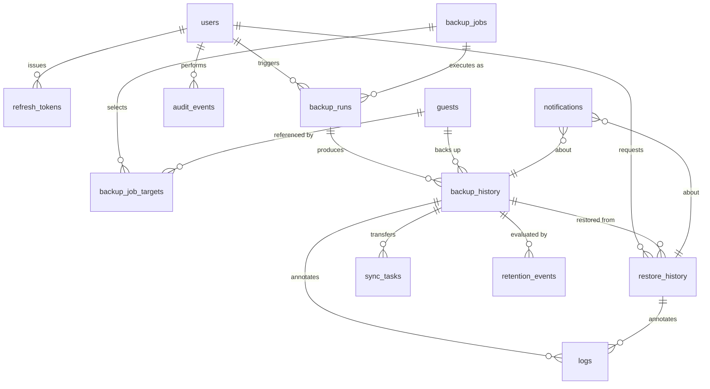

# ProxSync — Database Schema

SQLite (WAL) by default; PostgreSQL-ready. Every rule in §1 exists so that migration is a
configuration change plus `alembic upgrade head`, not a rewrite.

## 1. Portability rules

| Rule | Reason |
|---|---|
| Surrogate `BIGINT` primary keys, never `ROWID` semantics | Identical on both engines |
| `DateTime(timezone=True)`, all values stored **UTC** | SQLite has no native tz; the app normalises on write and renders in the user's timezone |
| Enumerations stored as `VARCHAR` + `CHECK` constraint, mirrored by a Python `StrEnum` | Native `ENUM` types are PostgreSQL-only and painful to alter |
| Structured payloads in `JSON` columns (SQLAlchemy `JSON`) | Maps to `TEXT` on SQLite, `JSONB` on PostgreSQL via a dialect variant |
| Explicit constraint naming convention on `MetaData` | SQLite's batch-mode ALTER in Alembic requires named constraints |
| No raw SQL in application code; no `INSERT OR REPLACE`, no `RETURNING` outside the ORM | Dialect-specific |
| Money/size values as `BIGINT` bytes, never floats | Exactness |

```python
NAMING_CONVENTION = {
    "ix": "ix_%(column_0_label)s",
    "uq": "uq_%(table_name)s_%(column_0_name)s",
    "ck": "ck_%(table_name)s_%(constraint_name)s",
    "fk": "fk_%(table_name)s_%(column_0_name)s_%(referred_table_name)s",
    "pk": "pk_%(table_name)s",
}
```

SQLite pragmas applied on every connection: `foreign_keys=ON`, `journal_mode=WAL`,
`busy_timeout=5000`, `synchronous=NORMAL`.

## 2. ERD



## 3. Tables

### 3.1 `users`

| Column | Type | Notes |
|---|---|---|
| `id` | BIGINT PK | |
| `username` | VARCHAR(64) | UNIQUE, case-folded on write |
| `email` | VARCHAR(255) | UNIQUE, nullable |
| `password_hash` | VARCHAR(255) | Argon2id — `time_cost=3, memory_cost=65536, parallelism=4` |
| `role` | VARCHAR(16) | CHECK in (`admin`,`operator`,`viewer`) |
| `is_active` | BOOLEAN | default true |
| `must_change_password` | BOOLEAN | true for the bootstrap account |
| `failed_login_count` | INTEGER | default 0 |
| `locked_until` | TIMESTAMPTZ | null when unlocked |
| `last_login_at`, `last_login_ip` | TIMESTAMPTZ, VARCHAR(45) | |
| `created_at`, `updated_at` | TIMESTAMPTZ | |

Roles: `admin` = everything including settings and users; `operator` = run backups/restores;
`viewer` = read-only.

### 3.2 `refresh_tokens`

| Column | Type | Notes |
|---|---|---|
| `id` | BIGINT PK | |
| `user_id` | BIGINT FK → users ON DELETE CASCADE | |
| `token_hash` | CHAR(64) | SHA-256 of the token; the token itself is never stored |
| `family_id` | CHAR(36) | Rotation family — reuse of a rotated token revokes the whole family |
| `expires_at`, `revoked_at` | TIMESTAMPTZ | |
| `user_agent`, `ip_address` | VARCHAR(255), VARCHAR(45) | |
| `created_at` | TIMESTAMPTZ | |

Index: `(user_id, expires_at)`, UNIQUE `(token_hash)`.

### 3.3 `settings`

Typed key–value store, one row per setting, grouped by section.

| Column | Type | Notes |
|---|---|---|
| `id` | BIGINT PK | |
| `section` | VARCHAR(32) | `general`, `gdrive`, `telegram`, `retention`, `agent`, `proxmox` |
| `key` | VARCHAR(64) | UNIQUE together with `section` |
| `value` | JSON | Always a JSON scalar/object, validated by a Pydantic model per section |
| `value_type` | VARCHAR(16) | `string`,`int`,`bool`,`json`,`secret` |
| `is_secret` | BOOLEAN | Secrets are Fernet-encrypted at rest and never returned by the API |
| `updated_by` | BIGINT FK → users | |
| `updated_at` | TIMESTAMPTZ | |

Defaults seeded by migration: `general.timezone=Asia/Jakarta`,
`general.storage_path=/mnt/backup-hdd`, `general.backup_folder=dump`,
`general.temp_folder=/mnt/backup-hdd/tmp`, `retention.keep_local=2`,
`retention.keep_remote=2`, `retention.scope=per_guest`, `gdrive.bandwidth_limit=0`,
`gdrive.transfers=4`, `gdrive.upload_retry=3`.

### 3.4 `guests` — cached PVE inventory

| Column | Type | Notes |
|---|---|---|
| `id` | BIGINT PK | |
| `vmid` | INTEGER | UNIQUE together with `node` |
| `guest_type` | VARCHAR(8) | CHECK in (`vm`,`lxc`) |
| `name` | VARCHAR(128) | |
| `node` | VARCHAR(64) | |
| `status` | VARCHAR(16) | `running`,`stopped`,`unknown` |
| `backup_enabled` | BOOLEAN | Allow-list flag — a guest must be enabled to be backed up |
| `tags`, `raw` | JSON | Last PVE payload, for diagnostics |
| `first_seen_at`, `last_seen_at` | TIMESTAMPTZ | Rows are kept when a guest disappears, so history stays joinable |

### 3.5 `backup_jobs`

| Column | Type | Notes |
|---|---|---|
| `id` | BIGINT PK | |
| `name` | VARCHAR(128) | UNIQUE |
| `enabled` | BOOLEAN | |
| `cron_expression` | VARCHAR(64) | default `0 1 * * 0` |
| `timezone` | VARCHAR(64) | default `Asia/Jakarta` |
| `mode` | VARCHAR(16) | CHECK in (`snapshot`,`suspend`,`stop`) |
| `compression` | VARCHAR(16) | CHECK in (`zstd`,`gzip`,`lzo`,`none`) — default `zstd` |
| `zstd_threads` | INTEGER | vzdump `--zstd` worker count; 0 = half the host's cores, NULL = PVE default. PVE has no compression *level* setting |
| `storage` | VARCHAR(64) | PVE storage id, default `backup-hdd` |
| `target_selector` | VARCHAR(16) | CHECK in (`all`,`include`,`exclude`) |
| `keep_local`, `keep_remote` | INTEGER | Per-job override of the global retention |
| `upload_enabled` | BOOLEAN | |
| `notify_on_start/success/failure` | BOOLEAN | |
| `bwlimit_kbps`, `max_parallel` | INTEGER | |
| `last_run_at`, `next_run_at` | TIMESTAMPTZ | Mirrored from APScheduler for display |
| `created_at`, `updated_at`, `created_by` | | |

### 3.6 `backup_job_targets`

`(job_id, vmid, guest_type)` with UNIQUE `(job_id, vmid)` — the include/exclude set.

### 3.7 `backup_runs` — one execution of a job or a manual trigger

| Column | Type | Notes |
|---|---|---|
| `id` | BIGINT PK | |
| `job_id` | BIGINT FK → backup_jobs, nullable | null for manual runs |
| `trigger` | VARCHAR(16) | `schedule`,`manual`,`api` |
| `status` | VARCHAR(24) | `queued`,`running`,`success`,`partial`,`failed`,`cancelled`,`skipped_agent_unavailable` |
| `requested_by` | BIGINT FK → users, nullable | |
| `guest_total/succeeded/failed` | INTEGER | |
| `targets` | JSON | Guest plan resolved when the run is requested |
| `options` | JSON | Frozen execution options; job-backed runs also preserve that job's `keep_local`/`keep_remote` |
| `started_at`, `finished_at`, `duration_seconds` | | |
| `error_message` | TEXT | |
| `correlation_id` | CHAR(36) | Ties together every log line, agent task and notification |

### 3.8 `backup_history` — one backup artifact

The central table.

| Column | Type | Notes |
|---|---|---|
| `id` | BIGINT PK | |
| `run_id` | BIGINT FK → backup_runs ON DELETE SET NULL | |
| `guest_id` | BIGINT FK → guests | |
| `vmid` | INTEGER | Denormalised — survives guest deletion |
| `guest_type` | VARCHAR(8) | `vm`,`lxc` |
| `guest_name` | VARCHAR(128) | Snapshot of the name at backup time |
| `node`, `storage` | VARCHAR(64) | |
| `filename` | VARCHAR(255) | e.g. `vzdump-qemu-101-2026_07_19-01_00_04.vma.zst` |
| `local_path` | VARCHAR(512) | Absolute, canonicalised |
| `size_bytes` | BIGINT | |
| `mode`, `compression` | VARCHAR(16) | |
| `checksum_sha256` | CHAR(64) | Computed on the host after the artifact is closed |
| `status` | VARCHAR(16) | `running`,`success`,`failed`,`interrupted`,`deleted` |
| `agent_task_id` | CHAR(36) | The agent's task id — the correlation handle. CLI-invoked vzdump produces no PVE UPID |
| `started_at`, `finished_at`, `duration_seconds` | | |
| `error_message` | TEXT | |
| `log_path` | VARCHAR(512) | Agent-side task log |
| `upload_status` | VARCHAR(16) | `not_required`,`pending`,`uploading`,`uploaded`,`failed` |
| `uploaded_at` | TIMESTAMPTZ | |
| `remote_path` | VARCHAR(512) | |
| `remote_size_bytes` | BIGINT | |
| `remote_checksum` | CHAR(64) | Populated by the verify step |
| `retention_locked` | BOOLEAN | Pinned: retention will never delete it |
| `local_deleted_at`, `remote_deleted_at` | TIMESTAMPTZ | Soft-delete markers |
| `created_at`, `updated_at` | | |

Indexes: `(vmid, guest_type, started_at DESC)` — the retention and history queries;
`(status)`, `(upload_status)`, `(run_id)`, UNIQUE `(storage, filename)`.

Artifact status is copy-aware. Removing only the local or only the remote object leaves
`status='success'` while the other usable copy remains; `status='deleted'` means neither
location contains a usable copy. The independent `local_deleted_at` and `remote_deleted_at`
markers are the authoritative location state.

### 3.9 `sync_tasks` — rclone transfers

| Column | Type | Notes |
|---|---|---|
| `id` | BIGINT PK | |
| `backup_id` | BIGINT FK → backup_history, nullable | null for a full-folder sync |
| `direction` | VARCHAR(16) | `upload`,`download`,`verify` |
| `status` | VARCHAR(16) | `queued`,`running`,`success`,`failed`,`cancelled` |
| `agent_task_id` | CHAR(36) | |
| `remote_name`, `remote_path` | VARCHAR | |
| `bytes_total`, `bytes_transferred` | BIGINT | |
| `transfer_rate_bps` | BIGINT | Last sample, for the progress bar |
| `attempt`, `max_attempts` | INTEGER | |
| `next_retry_at` | TIMESTAMPTZ | Exponential backoff |
| `started_at`, `finished_at`, `error_message` | | |

### 3.10 `restore_history`

| Column | Type | Notes |
|---|---|---|
| `id` | BIGINT PK | |
| `backup_id` | BIGINT FK → backup_history | |
| `source` | VARCHAR(16) | `local`,`gdrive` (a Drive restore downloads first) |
| `target_vmid` | INTEGER | |
| `target_type` | VARCHAR(8) | `vm`,`lxc` |
| `restore_mode` | VARCHAR(16) | `original_id`,`new_id` |
| `target_node`, `target_storage` | VARCHAR(64) | |
| `overwrite_existing`, `force_stop`, `start_after_restore` | BOOLEAN | |
| `status` | VARCHAR(24) | `pending_confirmation`,`confirmed`,`running`,`success`,`failed`,`cancelled`,`interrupted`,`expired` |
| `confirmation_token_hash` | CHAR(64) | SHA-256 of the token. Cleared on confirm, cancel and expiry, so a token is single-use |
| `confirmation_expires_at`, `confirmed_at` | TIMESTAMPTZ | |
| `preflight` | JSON | The report, rewritten with the re-check performed at confirmation |
| `agent_task_id` | CHAR(36) | |
| `requested_by` | BIGINT FK → users | |
| `started_at`, `finished_at`, `duration_seconds`, `error_message`, `log_path` | | |

`interrupted` exists for the same reason it does on `backup_history`, and matters more here.
`qmrestore` and `pct restore` destroy the target and rebuild it, so a dashboard that lost
contact mid-restore must not record `failed`: an operator reading "it did not happen" could
start a second restore over a guest that is still being written. A restore is never re-issued
automatically. A row left `running` by a crash is reconciled at startup — adopted if the agent
still knows the task, `interrupted` if it does not.

The table is also the executor's queue: rows are claimed in `confirmed`, oldest first.

### 3.11 `retention_events`

| Column | Type | Notes |
|---|---|---|
| `id` | BIGINT PK | |
| `backup_id` | BIGINT FK → backup_history ON DELETE SET NULL | |
| `vmid`, `guest_type` | | Denormalised |
| `action` | VARCHAR(24) | `evaluated`,`kept`,`deleted_local`,`deleted_remote`,`skipped`,`failed` |
| `reason` | VARCHAR(255) | e.g. `newer_than_keep_2`, `blocked_upload_pending`, `retention_locked` |
| `policy_snapshot` | JSON | The exact policy applied, for auditability |
| `freed_bytes` | BIGINT | |
| `dry_run` | BOOLEAN | |
| `created_at` | TIMESTAMPTZ | |

### 3.12 `logs`

| Column | Type | Notes |
|---|---|---|
| `id` | BIGINT PK | |
| `ts` | TIMESTAMPTZ | |
| `level` | VARCHAR(8) | `debug`,`info`,`warning`,`error`,`critical` |
| `category` | VARCHAR(16) | `api`,`backup`,`restore`,`upload`,`retention`,`scheduler`,`auth`,`agent`,`notify`,`system` |
| `message` | TEXT | |
| `context` | JSON | structlog event dict, minus what the columns already hold |
| `correlation_id` | CHAR(36) | |
| `user_id`, `backup_id`, `restore_id`, `sync_task_id` | BIGINT FK, nullable | |

Indexes: `(ts DESC)`, `(category, ts DESC)`, `(level, ts DESC)`, `(correlation_id)`.
A periodic pass prunes rows older than `general.log_retention_days` (default 90).

Rows are written by a worker draining a bounded in-memory buffer, never by the logging call
itself: a synchronous write from a structlog processor would be inside whatever transaction
the call site had open. The foreign keys are therefore **best-effort** — a line can name a row
that was rolled back or has since been deleted, and it is written with the link cleared rather
than rejected. The ids remain in `context`, so nothing is lost but the join.

### 3.13 `notifications`

| Column | Type | Notes |
|---|---|---|
| `id` | BIGINT PK | |
| `channel` | VARCHAR(16) | `telegram` (extensible) |
| `event_type` | VARCHAR(32) | `backup_started`,`backup_success`,`backup_failed`,`restore_started`,`restore_finished`,`restore_failed`,`upload_failed`,`retention_deleted`,`storage_threshold`,`test` |
| `status` | VARCHAR(16) | `pending`,`sent`,`failed`,`suppressed` |
| `payload` | JSON | Rendered message + template variables; `suppressed_by` and `suppressed_reason` on a suppressed row |
| `dedupe_key` | VARCHAR(128) | Identity of the *occurrence being reported*, not of this row |
| `attempts`, `max_attempts`, `next_attempt_at` | INTEGER, TIMESTAMPTZ | Backoff state, so a restart resumes the schedule rather than restarting it |
| `backup_id`, `restore_id` | BIGINT FK, nullable | |
| `correlation_id` | CHAR(36) | |
| `sent_at`, `error_message`, `created_at` | | |

Indexes: `(status, created_at)` — the queue; `(channel, event_type, dedupe_key, created_at)` —
de-duplication.

Outbox pattern: rows are written in the same transaction as the state change, then delivered
by a worker. A Telegram outage never loses a notification and never blocks a backup.

The message text is **rendered at enqueue time** and stored in `payload`. A message that sat
through an outage says what was true when it was written, not what a redeployed template would
say an hour later.

`dedupe_key` is what lets the outbox tell a repeated report from a new one, and it is
deliberately **not unique**: a suppressed row carries the key of the row that displaced it.
Events that happen once per occurrence (a run finishing, a restore failing) are keyed uniquely
and a second enqueue writes nothing at all, which is what makes "exactly once" survive a
restart — the guarantee is a row, not a timer. Events that genuinely recur (a storage
threshold, a retention pass) are suppressed for a window instead, and the repeat is recorded
rather than dropped.

Delivery is at-least-once: `attempts` is incremented before the send, so a process that dies
mid-request leaves a row with a scheduled retry rather than one that looks unattempted.
Sending a message twice destroys nothing, which is why this trade is the opposite of the one
`backup_history` and `restore_history` make.

### 3.14 `storage_snapshots`

`(id, captured_at, local_total_bytes, local_used_bytes, local_free_bytes, remote_used_bytes,
remote_quota_bytes, backup_count, oldest_backup_at)` — sampled every 15 minutes, feeds the
storage trend chart and the "estimated remaining space" projection (linear fit over the
trailing 30 days of growth). A failed local read produces no row; a failed remote read still
produces the valid local row with both remote columns null. Missing upstream data is never
stored as zero.

The effective local percentage is derived at read time as
`clamp((local_total_bytes - local_free_bytes) / local_total_bytes * 100, 0, 100)`. This uses
space actually available to the backup process, including filesystem-reserved blocks, and is
classified with the current warning/critical settings. The sampler compares consecutive
snapshots and raises an alert only when severity moves upward into warning or critical.

### 3.15 `audit_events`

Security-relevant actions, kept separate from `logs` because retention and immutability
differ: `(id, ts, user_id, username_snapshot, action, resource_type, resource_id, ip_address,
user_agent, result, detail JSON)`. Actions include login success/failure, settings change,
user change, backup delete, retention override, and the three restore actions —
`restore_requested`, `restore_confirmed`, `restore_cancelled`. Cancelling is recorded
separately rather than as a failed confirmation: the trail must not claim an operator
authorised the thing they stopped.

Pruned against `general.audit_retention_days` (default 730) by the same worker that prunes
`logs`, and deliberately with a much longer default: application logs are diagnostic, this is
evidence.

## 4. Retention semantics

The rule is *per guest*, never global:

```sql
-- deletion candidates for one (vmid, guest_type)
SELECT id FROM backup_history
WHERE vmid = :vmid AND guest_type = :type
  AND status = 'success' AND local_deleted_at IS NULL AND retention_locked = 0
ORDER BY started_at DESC
LIMIT -1 OFFSET :keep_local;         -- everything past the newest N
```

A local candidate is deleted **only if** all hold:

1. It is not among the newest `keep_local` successful backups for that guest.
2. It is not `retention_locked`. Locked rows are excluded before ranking and therefore do
   not consume a keep slot.
3. The candidate and every member of the newest replacement set are safe with respect to
   upload: either `upload_status='not_required'`, or `upload_status='uploaded'` with a
   non-null `remote_path`.
4. No `restore_history` row references it with status `pending_confirmation`, `confirmed`,
   or `running`. The same blocker refuses a manual `DELETE /backups/{id}`: retention and an
   operator must not disagree about whether a restore's source may be removed.

Remote retention ranks only actual uploaded objects with a non-null remote path; a
`not_required` row never consumes a remote keep slot. Locked rows likewise sit outside the
remote rank. Remote deletion additionally requires enabled Drive sync and
`delete_remote_on_retention=true`, and the same active-restore blocker applies.

The retention worker starts with the application workers and runs a database-derived rescan
at startup. After that, committed copy-state, lock, retention/GDrive policy, and legacy-linked
job changes trigger guest-scoped passes (or a policy-driven rescan); there is no healthy-state
idle timer that would duplicate audit events, while failed passes receive bounded delayed retries.
A job-backed pass uses explicit provenance and the `keep_local`/`keep_remote` values frozen
in the triggering run's `options`, even if the job is later deleted. Manual/API backups use
current global settings. Each pass selects the newest eligible backup for its
`(vmid, guest_type)` immediately before execution. Legacy linked jobs use their surviving job
counts; ambiguous source-less orphan runs fail closed and audit skipped decisions.

An applying pass writes a `retention_events` row for every kept, skipped, deleted, or failed
decision, including configured dry-run passes. The `/retention/preview` endpoint is a
separate side-effect-free classifier: it neither deletes nor records events.

## 5. Migration policy

Revisions to date: `0001` baseline (15 tables) · `0002` run plan and `cancelled` backups ·
`0003` `interrupted` restores and `restore_cancelled` · `0004` `notifications.dedupe_key` and
`notify` in the log category vocabulary.

- One Alembic revision per schema change; migrations are reviewed like code.
- `render_as_batch=True` in `env.py` so SQLite gets table-rebuild ALTERs.
- Data migrations are separate revisions from structural ones.
- `alembic upgrade head` runs on service start in a `systemd` `ExecStartPre`, guarded by a
  file lock so two workers can't race.
